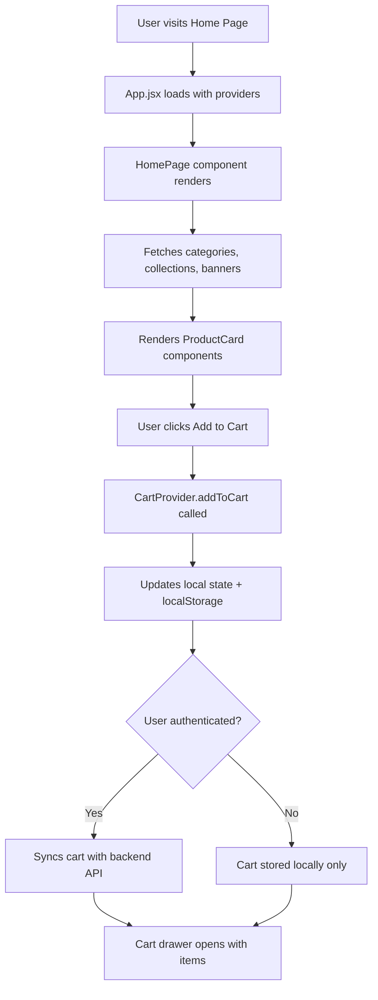
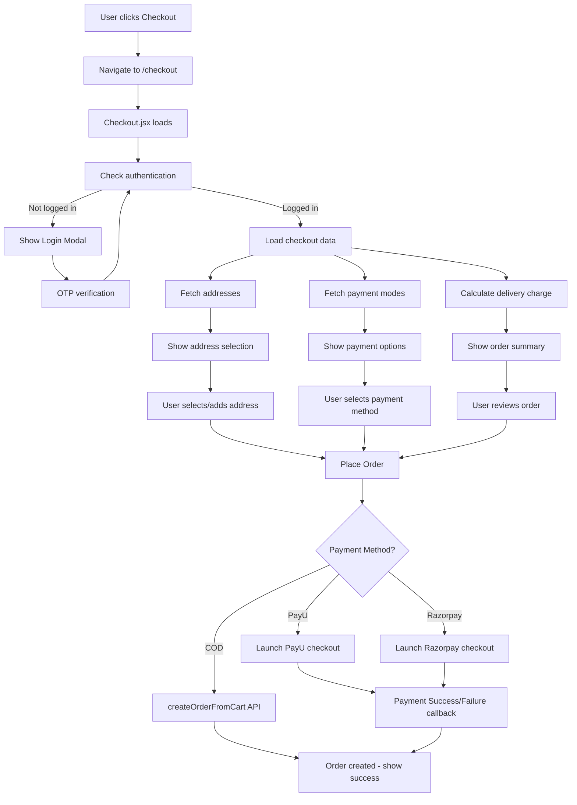
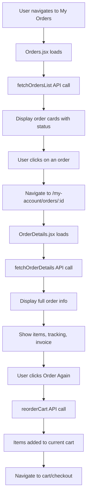

# GGU Website - Developer Guide

A comprehensive guide for developers to understand the project structure, functional flows, environment configuration, and key integrations.

---

## Table of Contents

1. [Project Overview](#project-overview)
2. [Technology Stack](#technology-stack)
3. [Project Structure](#project-structure)
4. [Environment Variables](#environment-variables)
5. [Functional Flows](#functional-flows)
   - [Home Page to Add to Cart](#1-home-page-to-add-to-cart)
   - [Checkout Flow](#2-checkout-flow)
   - [Order Details and Order Again](#3-order-details-and-order-again)
6. [Payment Integrations](#payment-integrations)
   - [PayU Integration](#payu-integration)
   - [Razorpay Integration](#razorpay-integration)
   - [Cash on Delivery (COD)](#cash-on-delivery-cod)
7. [Delivery Charge Calculation](#delivery-charge-calculation)
8. [Shiprocket Integration](#shiprocket-integration)
9. [State Management](#state-management)
10. [API Service Layer](#api-service-layer)
11. [Getting Started](#getting-started)

---

## Project Overview

GGU Website is an e-commerce platform built for **Ganesh Gruh Udyog**, a snacks and food products business. The application provides a complete shopping experience including product browsing, cart management, checkout with multiple payment options, order tracking, and user account management.

---

## Technology Stack

| Category | Technology |
|----------|------------|
| **Framework** | React 19 with Vite |
| **Styling** | Tailwind CSS 4 |
| **Routing** | React Router DOM 6 |
| **State Management** | React Context API + useReducer |
| **UI Components** | Radix UI (shadcn/ui) |
| **Animations** | Framer Motion |
| **Icons** | Lucide React |
| **Notifications** | Sonner (Toast) |
| **Forms** | React Hook Form |
| **Carousel** | React Slick |

---

## Project Structure

```
ggu-website/
├── public/                   # Static assets (images, icons, PWA files)
├── src/
│   ├── assets/              # Application assets
│   ├── components/          # React components (74 files)
│   │   ├── ui/              # shadcn/ui base components (46 files)
│   │   ├── Header.jsx       # Main navigation header
│   │   ├── Footer.jsx       # Site footer
│   │   ├── Cart.jsx         # Shopping cart drawer
│   │   ├── Checkout.jsx     # Checkout page component
│   │   ├── ProductCard.jsx  # Product display card
│   │   ├── ProductDetails.jsx # Product detail page
│   │   ├── Orders.jsx       # Order listing
│   │   ├── OrderDetails.jsx # Individual order details
│   │   └── ...              # Other components
│   ├── config/              # Configuration files
│   │   ├── shiprocket.js    # Shiprocket API config
│   │   ├── googlePlaces.js  # Google Places config
│   │   └── env.example.js   # Environment variable template
│   ├── contexts/            # React Context providers
│   │   ├── AuthContext.jsx  # Authentication state
│   │   ├── CartProvider.jsx # Cart state management
│   │   ├── CartContext.js   # Cart context definition
│   │   ├── cart/            # Cart-related utilities
│   │   ├── RazorpayContext.jsx
│   │   ├── StoreStatusContext.jsx
│   │   └── LoginModalContext.jsx
│   ├── hooks/               # Custom React hooks
│   │   ├── use-mobile.js    # Mobile detection
│   │   └── use-theme.js     # Theme management
│   ├── pages/               # Page components
│   │   ├── ShopPage.jsx     # Main shop/products page
│   │   ├── CategoryPage.jsx
│   │   ├── CollectionPage.jsx
│   │   ├── FestivalPage.jsx
│   │   ├── SearchResultsPage.jsx
│   │   └── AllCategoryPage.jsx
│   ├── services/            # API service layer
│   │   ├── api.js           # Main API service (2500+ lines)
│   │   ├── payu.js          # PayU payment integration
│   │   ├── razorpay.js      # Razorpay payment integration
│   │   ├── shiprocket.js    # Shiprocket delivery integration
│   │   └── placesApi.js     # Google Places API
│   ├── utils/               # Utility functions
│   ├── App.jsx              # Main application component
│   ├── App.css              # Global styles
│   ├── index.css            # Base CSS
│   └── main.jsx             # Application entry point
├── .env                     # Environment variables (example)
├── .env.local               # Local environment variables
├── package.json             # Dependencies
├── vite.config.js           # Vite configuration
└── README.md                # Project README
```

---

## Environment Variables

Create a `.env.local` file in the root directory with the following variables:

### Required Variables

| Variable | Description | Example |
|----------|-------------|---------|
| `VITE_API_URL` | Backend API base URL | `http://localhost:8080` or `https://api.ganeshgruhudyog.com` |
| `VITE_X_COMPANY_ID` | Company ID for API headers | `136` |
| `VITE_X_BRANCH_ID` | Branch ID for API headers | `136` |

### Payment Integration Variables

| Variable | Description | Example |
|----------|-------------|---------|
| `VITE_PAYU_ENV` | PayU environment (`production` or `test`) | `production` |

### Shiprocket Variables

| Variable | Description | Example |
|----------|-------------|---------|
| `VITE_SHIPROCKET_API_KEY` | Shiprocket API key | `your-api-key` |
| `VITE_SHIPROCKET_API_SECRET` | Shiprocket API secret | `your-api-secret` |
| `VITE_SHIPROCKET_MODE` | Override mode for testing | `development` |
| `VITE_BACKEND_URL` | Backend URL for Shiprocket | `http://localhost:8080` |

### Google Places Variables

| Variable | Description | Example |
|----------|-------------|---------|
| `VITE_GOOGLE_PLACES_API_KEY` | Google Places API key | `AIzaSy...` |

### Other Variables

| Variable | Description | Example |
|----------|-------------|---------|
| `VITE_INVOICE_VIEW_URL` | Invoice view base URL | `https://funcrisp.in/i/` |

### Sample `.env.local`

```env
VITE_API_URL=http://localhost:8080
VITE_X_COMPANY_ID=136
VITE_X_BRANCH_ID=136
VITE_PAYU_ENV=production
VITE_GOOGLE_PLACES_API_KEY=your-google-places-api-key
VITE_SHIPROCKET_API_KEY=your-shiprocket-api-key
VITE_SHIPROCKET_API_SECRET=your-shiprocket-api-secret
VITE_BACKEND_URL=http://localhost:8080
VITE_INVOICE_VIEW_URL=https://funcrisp.in/i/
```

> **Note:** All environment variables must be prefixed with `VITE_` to be accessible in the browser.

---

## Functional Flows

### 1. Home Page to Add to Cart



#### Key Components Involved:

1. **`App.jsx`** - Main application wrapper with routing and global providers
2. **`HomePage`** - Displays collections, categories, banners
3. **`ProductCard.jsx`** - Individual product display with Add to Cart button
4. **`ProductDetails.jsx`** - Full product page with variant selection
5. **`Cart.jsx`** - Cart drawer showing items and totals
6. **`CartProvider.jsx`** - Cart state management using useReducer

#### Cart State Flow:

```javascript
// src/contexts/CartProvider.jsx
CartProvider → useReducer → cartReducer
    ├── ADD_ITEM → Adds item to cart
    ├── REMOVE_ITEM → Removes item
    ├── UPDATE_QUANTITY → Changes quantity
    ├── SET_CART → Sets entire cart (from API)
    ├── CLEAR_CART → Empties cart
    └── SET_LOADING → Loading state
```

---

### 2. Checkout Flow



#### Checkout Component Functions:

| Function | Description |
|----------|-------------|
| `loadCheckoutType()` | Fetches checkout configuration (both/pickup/delivery) |
| `loadPaymentModes()` | Fetches available payment methods (COD, PayU, Razorpay) |
| `loadAddresses()` | Fetches user's saved addresses |
| `refreshDeliveryCharge()` | Calculates delivery based on cart total and address |
| `handlePlaceOrder()` | Main order placement logic with payment handling |

---

### 3. Order Details and Order Again



#### Key APIs:

| API Function | Endpoint | Description |
|--------------|----------|-------------|
| `fetchOrdersList` | `GET /api/ecom/sales/list-by-customer` | Lists all orders for customer |
| `fetchOrderDetails` | `GET /api/ecom/sales/{orderId}` | Gets single order details |
| `reorderCart` | `POST /api/ecom/cart/reorder/{orderId}` | Adds past order items to cart |

---

## Payment Integrations

The application supports three payment methods:

### PayU Integration

**File:** `src/services/payu.js`

```javascript
// Key functions
loadPayUScript()        // Loads PayU Bolt SDK
launchPayUCheckout()    // Opens PayU payment modal
handlePayUResponse()    // Processes payment result
```

**Flow:**
1. User selects PayU payment
2. Frontend calls `generatePayUHash` API to get payment parameters
3. `launchPayUCheckout()` opens PayU Bolt modal
4. On success/failure, callbacks notify backend via:
   - `notifyPayUSuccess` - Creates order after successful payment
   - `notifyPayUFailure` - Logs failed payment attempt

**Environment:**
- Production: `https://jssdk.payu.in/bolt/bolt.min.js`
- UAT: `https://jssdk-uat.payu.in/bolt/bolt.min.js`

---

### Razorpay Integration

**File:** `src/services/razorpay.js`

```javascript
// Key functions
loadRazorpayScript()      // Loads Razorpay SDK
launchRazorpayCheckout()  // Opens Razorpay modal
formatRazorpayResponse()  // Formats response for backend
```

**Flow:**
1. User selects Razorpay payment
2. Frontend creates Razorpay order via backend
3. `launchRazorpayCheckout()` opens Razorpay modal
4. On success, payment verified and order created

---

### Cash on Delivery (COD)

No external SDK required. Order is created directly via:

```javascript
createOrderFromCart({
  paymentMode: 'COD',
  shippingAddressId: selectedAddressId,
  note: orderNote,
  deliveryMode: 'standard' // or 'express'
})
```

---

## Delivery Charge Calculation

**API:** `POST /api/ecom/settings/delivery-charge/calculate/v2`

The delivery charge calculation considers:
- Order total amount
- Delivery address
- Selected delivery mode (Standard/Express)
- Free delivery thresholds

```javascript
// src/services/api.js
export const calculateDeliveryCharge = async (orderAmount) => {
  const data = await apiRequest('/api/ecom/settings/delivery-charge/calculate/v2', {
    method: 'POST',
    body: JSON.stringify({ orderAmount }),
  });
  return data;
}
```

**Response Structure:**
```json
{
  "status": true,
  "response": {
    "deliveryCharge": 50,
    "deliveryChargeType": "fixed",
    "freeDeliveryApplied": false,
    "standardOption": {
      "charge": 50,
      "estimatedDelivery": "3-5 days"
    },
    "expressOption": {
      "charge": 100,
      "estimatedDelivery": "1-2 days"
    }
  }
}
```

---

## Shiprocket Integration

**File:** `src/services/shiprocket.js`

Shiprocket is used for:
- Delivery rate calculation
- Shipment tracking
- Headless checkout (optional)

**Key Functions:**

| Function | Description |
|----------|-------------|
| `generateShiprocketToken()` | Gets checkout token from backend |
| `loadShiprocketCheckoutScript()` | Loads Shiprocket checkout SDK |
| `launchShiprocketCheckout()` | Opens Shiprocket checkout modal |
| `handleCheckoutSuccess()` | Processes successful checkout |
| `fetchOrderDetails()` | Gets order details from Shiprocket |

**Configuration:** `src/config/shiprocket.js`

```javascript
export const SHIPROCKET_CONFIG = {
  API_KEY: import.meta.env.VITE_SHIPROCKET_API_KEY,
  API_SECRET: import.meta.env.VITE_SHIPROCKET_API_SECRET,
  BASE_URL: 'https://checkout-api.shiprocket.com',
  BACKEND_URL: import.meta.env.VITE_BACKEND_URL || 'http://localhost:8080',
  CHECKOUT_UI_URL: 'https://checkout-ui.shiprocket.com',
}
```

---

## State Management

### Context Providers

The app uses multiple React Context providers for state management:

```jsx
// src/main.jsx → App hierarchy
<BrowserRouter>
  <AuthProvider>           // User authentication
    <CartProvider>         // Shopping cart
      <RazorpayProvider>   // Razorpay credentials
        <StoreStatusProvider>  // Store open/closed status
          <LoginModalProvider> // Login modal visibility
            <App />
          </LoginModalProvider>
        </StoreStatusProvider>
      </RazorpayProvider>
    </CartProvider>
  </AuthProvider>
</BrowserRouter>
```

### AuthContext (`src/contexts/AuthContext.jsx`)

Manages:
- User authentication state (`isAuthenticated`)
- User data (`user`)
- Login/Logout functions
- Token management (`accessToken` in localStorage)

### CartContext (`src/contexts/CartProvider.jsx`)

Manages:
- Cart items array
- Loading states
- Add/Remove/Update operations
- Cart synchronization with backend
- Reorder functionality

Key exports:
```javascript
const { 
  cartItems,
  addToCart, 
  removeFromCart, 
  updateQuantity,
  getCartQuantity,
  clearCart,
  isItemLoading
} = useCart();
```

---

## API Service Layer

**File:** `src/services/api.js` (2500+ lines)

All backend API calls are centralized in this file.

### Core Configuration

```javascript
export const BASE_URL = import.meta.env.VITE_API_URL || 'http://localhost:8080';

const getDefaultHeaders = () => ({
  'X-Company-Id': import.meta.env.VITE_X_COMPANY_ID,
  'X-Branch-Id': import.meta.env.VITE_X_BRANCH_ID,
});
```

### API Categories

| Category | Key Functions |
|----------|---------------|
| **Products** | `fetchProducts`, `fetchProductDetails`, `fetchProductsByCategories` |
| **Categories** | `fetchCategories`, `fetchBrands` |
| **Cart** | `syncCart`, `getCart`, `validateCart`, `deleteCartItem` |
| **Orders** | `fetchOrdersList`, `fetchOrderDetails`, `createOrderFromCart` |
| **Wishlist** | `addToWishlist`, `removeFromWishlist`, `fetchWishlist` |
| **Auth** | `sendOtp`, `verifyOtp` |
| **Address** | `fetchAddresses`, `createAddress`, `updateAddress`, `deleteAddress` |
| **Payments** | `generatePayUHash`, `notifyPayUSuccess`, `fetchPaymentModes` |
| **Delivery** | `calculateDeliveryCharge` |
| **Settings** | `fetchStoreStatus`, `fetchCheckoutMode`, `fetchCheckoutType` |

### Error Handling

All API calls handle:
- 401 Unauthorized → Clears auth and redirects
- Network errors → Shows appropriate UI feedback
- API unavailable → Triggers maintenance mode

---

## Getting Started

### Prerequisites

- Node.js 18+
- npm or pnpm
- Backend API running (Spring Boot)

### Installation

```bash
# Clone the repository
git clone <repository-url>
cd ggu-website

# Install dependencies
npm install
# or
pnpm install

# Create environment file
cp .env .env.local
# Edit .env.local with your values

# Start development server
npm run dev
```

### Available Scripts

| Script | Description |
|--------|-------------|
| `npm run dev` | Start development server |
| `npm run dev:https` | Start with HTTPS |
| `npm run build` | Production build |
| `npm run preview` | Preview production build |
| `npm run lint` | Run ESLint |
| `npm run analyze` | Bundle analysis |

### Development Tips

1. **API Switching:** Comment/uncomment lines in `src/services/api.js` to switch between local/staging/production backends
2. **Mobile Testing:** Use `npm run dev` (includes `--host` flag) to access from mobile devices on same network
3. **Payment Testing:** Set `VITE_PAYU_ENV=test` for PayU UAT environment
4. **Debug Mode:** Check browser console for API logs (enabled in development)

---

## Quick Reference - API Endpoints

### Authentication
- `POST /api/ecom/login/send-otp?mobile={mobile}`
- `POST /api/ecom/login/verify-otp?mobile={mobile}&otp={otp}`

### Products
- `GET /api/ecom/products/list/by-categories?categoryIds={ids}&limit={n}&page={p}`
- `GET /api/ecom/products/{slug}`
- `GET /api/ecom/products/search?searchValue={query}`

### Cart
- `POST /api/ecom/cart/sync` - Sync cart with backend
- `DELETE /api/ecom/cart/item/{variantId}` - Remove item
- `POST /api/ecom/cart/validate` - Validate cart items

### Orders
- `POST /api/ecom/sales/create-from-cart` - Create order
- `GET /api/ecom/sales/list-by-customer?page={p}&size={s}` - List orders
- `GET /api/ecom/sales/{orderId}` - Order details

### Payments
- `POST /api/ecom/payment/payu/order` - Generate PayU hash
- `POST /api/ecom/payment/payu/success` - PayU success callback
- `POST /api/ecom/payment/payu/failure` - PayU failure callback

---

*Last Updated: January 2026*
